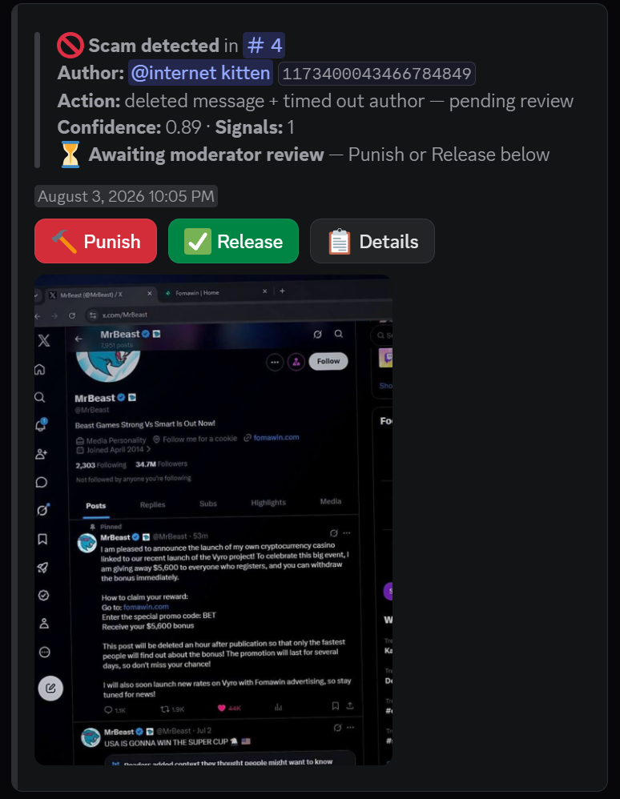
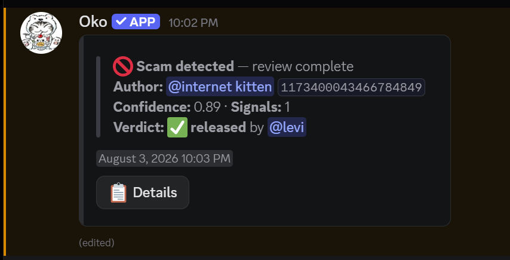

<div align="center">


# Oko

**Automatic crypto giveaway / phishing scam detection for Discord.**

Oko watches every message and image posted in your server, catches scam giveaways and phishing links before members can click them, and removes the message automatically. No moderator required.

[github.com/totalling/Oko-Anti-Scam-discord-bot](https://github.com/totalling/Oko-Anti-Scam-discord-bot)

</div>

---

## What it catches

Scammers post the same handful of tricks over and over: a compromised or fake "verified" account announces a crypto giveaway, links a lookalike domain, and pressures people to act fast before the post is "deleted." Oko is built to catch exactly that pattern.

- **Text scans**: giveaway language, promo/bonus codes, urgency phrases ("only the fastest," "post will be deleted"), and known scam domains
- **Image scans (OCR)**: scam text baked into a screenshot is extracted and scanned the same way plain text is
- **Perceptual image hashing**: once one server flags an image as scam, every server running Oko recognizes near-identical reposts of it, even if it's cropped or recompressed
- **Impersonation detection**: flags messages that pair a watched public figure/brand name with giveaway bait
- **Honeypot channels**: an optional trap channel that punishes anyone (other than moderators) who posts a Discord invite link, an image/attachment, or a scam-pattern message in it. Harmless text is deleted but not punished
- **Global blacklist**: opt-in, cross-server. When Oko bans someone in one server, every other server that's enabled it punishes that same user too, immediately if they're already a member, or the moment they join
- **Review mode**: optionally hold offenders in a timeout while moderators approve the punishment or release them, right from the log channel
- **Compromised-account alerts**: banned/kicked users get a DM explaining their account was likely hacked and how to secure it

## In action

<table>
<tr>
<td width="50%"></td>
<td width="50%"></td>
</tr>
<tr>
<td align="center"><sub>Low-signal message → timed out</sub></td>
<td align="center"><sub>High-confidence scam (8 signals) → banned</sub></td>
</tr>
</table>

Every detection is logged to your mod channel with the offending message's evidence, a confidence score, and a **Details** button moderators can use to review exactly what was flagged.

## Commands

### Setup & configuration (`Manage Server` required)

| Command | Description |
|---|---|
| `/scam toggle` | Turn auto-moderation on or off for this server |
| `/scam setlogchannel` | Set the channel scam detections get logged to |
| `/scam setpunishment` | Choose what happens to users caught by auto-moderation: **ban**, **kick**, or **timeout** |
| `/scam review` | Hold offenders in a timeout until a moderator approves the punishment or releases them |
| `/scam threshold` | Set the confidence score (0.0–1.0) at which detections get punished in this server |
| `/scam history` | Show a user's recent scam-related actions recorded by Oko |
| `/scam globalblacklist` | Punish members here who were banned by Oko in another server (opt-in) |
| `/scam stats` | Show current settings and blocklist sizes |
| `/scam dashboard` | Interactive control panel: toggle auto-mod, review mode, global blacklist, and cycle punishment with buttons that update live |
| `/scam recent` | Show this server's most recent scam-related actions (all users, not just one) |
| `/scam simulate` | Dry-run the detector against pasted text and see the confidence/signals without taking any action, with a one-click button to blocklist a matched domain |
| `/scam pending` | List open review-mode cases awaiting a moderator decision, with jump links to each log entry |
| `/scamlists exempt adduser` / `removeuser` | Exempt a specific user from scam auto-moderation |
| `/scamlists exempt addrole` / `removerole` | Exempt everyone with a role from scam auto-moderation |
| `/scamlists ignorechannel add` / `remove` | Stop (or resume) scanning messages in a channel |
| `/scamlists list domains` / `names` | Browse the global blocklists, paginated with Prev/Next buttons |

### Honeypot (`Manage Server` required)

| Command | Description |
|---|---|
| `/scam honeypot setup` | Create a trap channel: anyone who types in it (except mods) is punished |
| `/scam honeypot setpunishment` | Choose the punishment for honeypot triggers, independent of the main scam punishment |
| `/scam honeypot disable` | Remove the honeypot channel |

### General

| Command | Description |
|---|---|
| `/invite` | Get an invite link to add Oko to another server |
| `/support` | Get an invite to the support server |
| `/botinfo` | Bot stats: servers, members protected, scammers caught |
| `/whois` | Look up a member: live status/activity, join date & position, roles, and key permissions |
| `/scam globalstats` | Public stats: total scammers caught bot-wide and recent global-blacklist activity |
| `/scam appeal` | Appeal your own global blacklist ban directly to the bot owner, who gets Approve/Deny buttons |
| **Mark as Known Scam** *(message context menu)* | Manually blacklist a message's author and learn its image hash |
| **Report Scam** *(message context menu)* | Let any member flag a suspicious message to the mod log channel |

### Bot owner only

| Command | Description |
|---|---|
| `/scam adddomain` / `removedomain` | Manage the global scam-domain blocklist |
| `/scam addname` | Add a name to the impersonation watchlist |
| `/scam unblacklist` | Remove a user from the global scam blacklist |
| `/scam blacklistlookup` | Look up a user's global-blacklist entry, with a one-click remove button |
| `/scamlists import` | Bulk-add domains or names from an uploaded `.txt` file (one entry per line) |
| `/scamlists removehash` | Remove a perceptual image hash from the scam-image blocklist |

## Setup

**Requirements:** Node.js 18+, and [Tesseract OCR](https://github.com/tesseract-ocr/tesseract) installed on the host (`brew install tesseract` on macOS, `apt install tesseract-ocr` on Debian/Ubuntu).

In the [Discord Developer Portal](https://discord.com/developers/applications), under your app's **Bot** settings, enable the **Server Members Intent** and **Presence Intent** privileged intents. Without them, scam scanning can't see message authors' roles and `/whois` can't show live status/activity.

```bash
git clone https://github.com/totalling/Oko-Anti-Scam-discord-bot.git
cd Oko-Anti-Scam-discord-bot
npm install
```

Create a `.env` file in the repo root:

```env
DISCORD_TOKEN=your-bot-token
TESSERACT_CMD=/opt/homebrew/bin/tesseract   # path to the tesseract binary

# Scoring thresholds (0.0 - 1.0)
HEURISTIC_AUTO_SCAM_SCORE=0.6
CONFIDENCE_BAN_THRESHOLD=0.6
HASH_DISTANCE_THRESHOLD=8
```

Run it:

```bash
npm start          # commands sync only when they changed (hash-checked, no rate-limit churn on restarts)
npm run deploy     # force-register slash commands manually
```

### Running as a service

A sample `systemd` unit is included at [`deploy/oko.service`](deploy/oko.service) for running Oko persistently on a Linux host.

## Project structure

```
src/commands/       Slash commands & context menus (/scam, /scamlists, /invite, /support, /botinfo, /whois, Mark as Known Scam, Report Scam)
src/events/         Event listeners (message scanning, joins, guild welcome, interactions)
src/detection/      Scam scoring: heuristics, OCR, perceptual image hashing
src/moderation/     Punishment actions, review flow, per-guild settings, mod-log UI (Components V2)
src/deploy.js       Hash-based command sync: skips registration when commands are unchanged
vendor/bouncer/     Vendored resilient fetch client (retries/backoff) for CDN attachment downloads
data/               Blocklists and persisted state (scam domains, watched names, guild settings)
deploy/             systemd unit for running the bot as a service
```

## Technical notes

- **Components V2 UI**: every bot message uses Discord's modern container components, no legacy embeds
- **Rate-limit safe restarts**: command definitions are SHA-256 hashed; on boot, registration is skipped entirely (zero API calls) unless commands actually changed, so frequent restarts never trip Discord's application-command rate limits
- **Fast scanning path**: blocklists and settings are memory-cached (no per-message disk reads), hash-matched images skip OCR entirely, and image downloads run concurrently
- **imagehash-compatible pHash**: perceptual hashes are computed with the same DCT algorithm as Python's `imagehash`, so hash databases stay interchangeable
